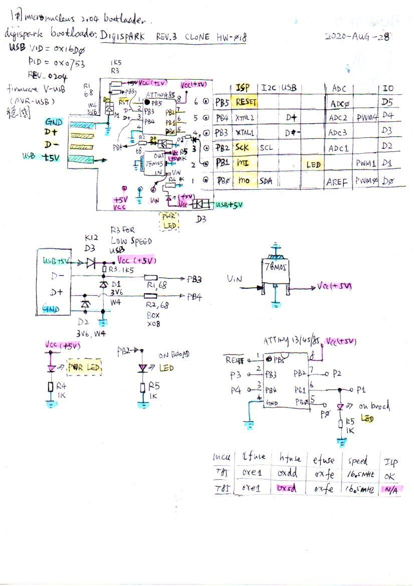
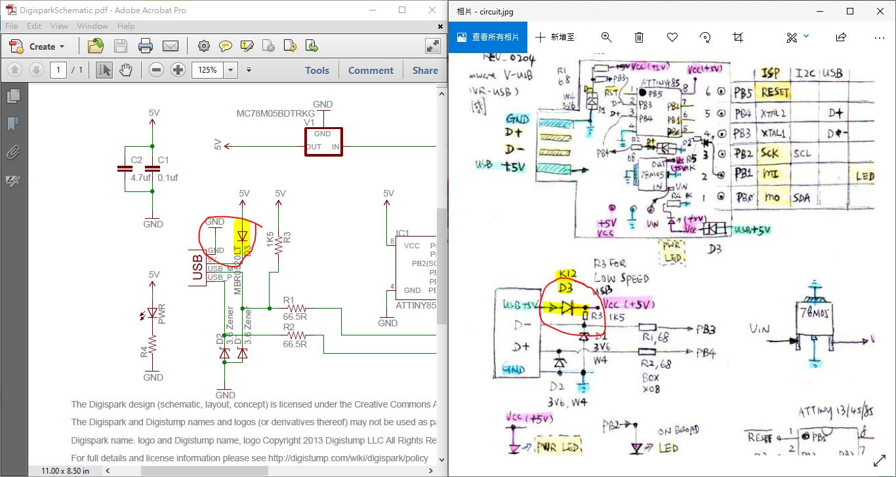

# AVR_Attiny85_micronucleus_2.6_blink[micronucleus_2.6_blink/](micronucleus_2.6_blink/)  
2021-NOV-12  
Win10 auto updated and then micronucleus_2.04 & device is not working anymore.  
solution, re-install Zidge driver https://zadig.akeo.ie/  
download micronucleus_2.6 https://github.com/micronucleus/micronucleus, author has changed the version numbering from 2.04, 2.05 and then to 2.6  
burn bootloader only, uses usptiny, attiny85_burn default bootloader2.6.bat   
burn bootloader + blink, burn_Attiny85_micronuclear2.6_blink.ino_hex.bat  


# AVR_Attiny85_micronucleus_2.04_blink
hardware, digispark rev.3, a counterfeit possible but the PCB printed with "digispark".


embed youtube video to Github README.md
```
[](https://www.youtube.com/watch?v=YOUTUBE_VIDEO_ID_HERE)
```
https://youtu.be/XggN00FlNCk  
[](https://www.youtube.com/watch?v=XggN00FlNCk)
.  
.  


my schematic,  [clone_digispark_rev.3_PCB_circuit.jpg.pdf](clone_digispark_rev.3_PCB_circuit.jpg.pdf)  
  
.  
.  
.  


USB +5V through a schottky diode to power Attiny85 (Vcc+5v), VF=0.2v, different from original digispark design (perhaps rev.2)  
  


bootloader, https://github.com/micronucleus/micronucleus 2.04 used.  
Arduino IDE 1.8.12  
Digispark is based on V-USB (AVR-USB formerly) [https://www.obdev.at/products/vusb/index.html](https://www.obdev.at/products/vusb/index.html)  
USB VID = 0x16D0, PID=0x0753  
Arduino ATtinycore has support now (forked https://github.com/xiaolaba/ATTinyCore), win10 driver installation with Zadig is ok.  
.  
.  
.  

### compile the micronucleus bootloader (V-USB) with your own pair VID/PID   
for example VID= 0x6666, PID= 0x8888 (testing purpose on the own, not to sell product). why do that, USB VID/PID pair has to be registered and pay for it, if you do not, and used other's but not buying hardware from the manufacturer, it is infringing the intellectual property, and USB supporting will be voilated.  
.  
locate the file and defination,   
.\micronucleus\firmware\usbconfig.h  
.  
```
/* -------------------------- Device Description --------------------------- */

//#define USB_CFG_VENDOR_ID 0xD0, 0x16 /* = 0x16d0 */
#define USB_CFG_VENDOR_ID 0x66, 0x66 /* VID = 6666 (Prototype product Vendor ID) */
/* USB vendor ID for the device, low byte first. If you have registered your
 * own Vendor ID, define it here. Otherwise you may use one of obdev's free
 * shared VID/PID pairs. Be sure to read USB-IDs-for-free.txt for rules!
 */
//#define  USB_CFG_DEVICE_ID 0x53, 0x07 /* = 0x0753 = Digistump */
#define  USB_CFG_DEVICE_ID 0x88, 0x88 /* = 0x8888, for testing */
/* This is the ID of the product, low byte first. It is interpreted in the
 * scope of the vendor ID. If you have registered your own VID with usb.org
 * or if you have licensed a PID from somebody else, define it here. Otherwise
 * you may use one of obdev's free shared VID/PID pairs. See the file
 * USB-IDs-for-free.txt for details!
 */
#define USB_CFG_DEVICE_VERSION MICRONUCLEUS_VERSION_MINOR, MICRONUCLEUS_VERSION_MAJOR
/* Version number of the device: Minor number first, then major number.
 */
 // electric arrow - not compliant with obdev's rules but we'll have our own vid-pid soon
//#define USB_CFG_VENDOR_NAME 0x2301
//#define USB_CFG_VENDOR_NAME_LEN 1
//#define USB_CFG_VENDOR_NAME 'd','i','g','i','s','t','u','m','p','.','c','o','m'
//#define USB_CFG_VENDOR_NAME_LEN 13
/* These two values define the vendor name returned by the USB device. The name
 * must be given as a list of characters under single quotes. The characters
 * are interpreted as Unicode (UTF-16) entities.
 * If you don't want a vendor name string, undefine these macros.
 * ALWAYS define a vendor name containing your Internet domain name if you use
 * obdev's free shared VID/PID pair. See the file USB-IDs-for-free.txt for
 * details.
 */
//#define USB_CFG_DEVICE_NAME 0x00B5,'B'
//#define USB_CFG_DEVICE_NAME_LEN 2
/* Same as above for the device name. If you don't want a device name, undefine
 * the macros. See the file USB-IDs-for-free.txt before you assign a name if
 * you use a shared VID/PID.
 */
/*#define USB_CFG_SERIAL_NUMBER   'N', 'o', 'n', 'e' */
/*#define USB_CFG_SERIAL_NUMBER_LEN   0 */
/* Same as above for the serial number. If you don't want a serial number,
 * undefine the macros.
 * It may be useful to provide the serial number through other means than at
 * compile time. See the section about descriptor properties below for how
 * to fine tune control over USB descriptors such as the string descriptor
 * for the serial number.
 */
```


### burn the hex to chip   
attiny85_burn.bat, and extrnal programmer has to be, no uses USB funcational or USB port.


### source code, AVR_Attiny85_micronucleus_2.04_blink
compile with Arduino IDE, uses AttinyCore
onboard LED blinking
```
/*
  Blink, test with ATtiny85, PB1 is connected to LED, source current
  // xiaolaba, 2020-AUG-30

  Turns an LED on for one second, then off for one second, repeatedly.

  Most Arduinos have an on-board LED you can control. On the UNO, MEGA and ZERO
  it is attached to digital pin 13, on MKR1000 on pin 6. LED_BUILTIN is set to
  the correct LED pin independent of which board is used.
  If you want to know what pin the on-board LED is connected to on your Arduino
  model, check the Technical Specs of your board at:
  https://www.arduino.cc/en/Main/Products

  modified 8 May 2014
  by Scott Fitzgerald
  modified 2 Sep 2016
  by Arturo Guadalupi
  modified 8 Sep 2016
  by Colby Newman

  This example code is in the public domain.

  http://www.arduino.cc/en/Tutorial/Blink
*/

/* 
 *  xiaolaba, 2020-AUG-30
 *  lfuse=0xe1
 *  hfuse=0x5d //RESET pin set as IO, no ISP is capable, need HV programmer to reset, be caution
 *  hfuse=0xdd //pin1, RESET is still available for ISP
 *  efuse=0xfe
*/


// xiaolaba, 2020-AUG-30
#define LED_BUILTIN PB1 // for, build in LED is conntect to PB1, source current, IO=High, LED lite, Disispark (Attiny85) or the clone


// the setup function runs once when you press reset or power the board
void setup() {
  // initialize digital pin LED_BUILTIN as an output.
  pinMode(LED_BUILTIN, OUTPUT);
}

// the loop function runs over and over again forever
void loop() {
  digitalWrite(LED_BUILTIN, HIGH);   // turn the LED on (HIGH is the voltage level)
  delay(1000);                       // wait for a second
  digitalWrite(LED_BUILTIN, LOW);    // turn the LED off by making the voltage LOW
  delay(1000);                       // wait for a second
}

```


### hex, AVR_Attiny85_micronucleus_2.04_blink
onboard LED blinking
```
:200000001FCD2CC02BC02AC029C0C8C027C026C025C024C023C022C021C020C01FC00000C7
:200020000000370000000000380002020202020201020408102001020000040011241FBEED
:20004000CFE5D2E0DEBFCDBF20E0A0E6B0E001C01D92A936B207E1F7E7D019C1D1CFE7E320
:20006000F0E02491E1E3F0E09491EBE2F0E0E491EE23C1F0222329F02130A9F42AB52F779D
:200080002ABDF0E0EE0FFF1FEC5DFF4FA591B49181111AC08FB7F8942C91E92FE095E223EF
:2000A000EC938FBF0895223019F42AB52F7DE8CF233021F420B72F7D20BFE3CF243009F765
:2000C0002CB52F7D2CBDDDCF8FB7F894EC91E92BE7CF0F931F933FB7F89480916500909178
:2000E0006600A0916700B091680022B708B601FE05C02F3F19F00196A11DB11D3FBFBA2F7D
:20010000A92F982F8827BC01CD01620F711D811D911D42E0660F771F881F991F4A95D1F788
:200120008B019C0155E036952795179507955A95D1F7601B710B820B930B1F910F910895CC
:20014000CF92DF92EF92FF92CF93DF93C2DFEB0188EEC82E83E0D82EE12CF12CBADF6C1B3B
:200160007D0B683E7340A0F0C114D104E104F10439F4DF91CF91FF90EF90DF90CF90089514
:2001800081E0C81AD108E108F108C851DC4FE6CFC114D104E104F10409F7EBCF1F920F92D8
:2001A0000FB60F9211242F933F938F939F93AF93BF938091610090916200A0916300B0915E
:2001C0006400309160002CE7230F2D3728F02FEF230F0196A11DB11D2093600080936100DF
:2001E00090936200A0936300B09364008091650090916600A0916700B09168000196A11DAA
:20020000B11D8093650090936600A0936700B0936800BF91AF919F918F913F912F910F90BB
:200220000FBE0F901F90189583E08ABD83BF789489B7826089BF80E48CBD8FEF8DBD87ECAC
:2002400080BF86B1876886B9379AE1E3F0E02491EBE2F0E08491882399F090E0880F991F3B
:20026000FC01E25EFF4FA591B491FC01EC5DFF4F859194918FB7F894EC91E22BEC938FBF80
:2002800081E0EDDE5DDF80E0EADE5ADFF9CFF894FFCFFFFFFFFFFFFFFFFFFFFFFFFFFFFF81
:2002A000FFFFFFFFFFFFFFFFFFFFFFFFFFFFFFFFFFFFFFFFFFFFFFFFFFFFFFFFFFFFFFFF5E
:2002C000FFFFFFFFFFFFFFFFFFFFFFFFFFFFFFFFFFFFFFFFFFFFFFFFFFFFFFFFFFFFFFFF3E
:2002E000FFFFFFFFFFFFFFFFFFFFFFFFFFFFFFFFFFFFFFFFFFFFFFFFFFFFFFFFFFFFFFFF1E
:20030000FFFFFFFFFFFFFFFFFFFFFFFFFFFFFFFFFFFFFFFFFFFFFFFFFFFFFFFFFFFFFFFFFD
:20032000FFFFFFFFFFFFFFFFFFFFFFFFFFFFFFFFFFFFFFFFFFFFFFFFFFFFFFFFFFFFFFFFDD
:20034000FFFFFFFFFFFFFFFFFFFFFFFFFFFFFFFFFFFFFFFFFFFFFFFFFFFFFFFFFFFFFFFFBD
:20036000FFFFFFFFFFFFFFFFFFFFFFFFFFFFFFFFFFFFFFFFFFFFFFFFFFFFFFFFFFFFFFFF9D
:20038000FFFFFFFFFFFFFFFFFFFFFFFFFFFFFFFFFFFFFFFFFFFFFFFFFFFFFFFFFFFFFFFF7D
:2003A000FFFFFFFFFFFFFFFFFFFFFFFFFFFFFFFFFFFFFFFFFFFFFFFFFFFFFFFFFFFFFFFF5D
:2003C000FFFFFFFFFFFFFFFFFFFFFFFFFFFFFFFFFFFFFFFFFFFFFFFFFFFFFFFFFFFFFFFF3D
:2003E000FFFFFFFFFFFFFFFFFFFFFFFFFFFFFFFFFFFFFFFFFFFFFFFFFFFFFFFFFFFFFFFF1D
:20040000FFFFFFFFFFFFFFFFFFFFFFFFFFFFFFFFFFFFFFFFFFFFFFFFFFFFFFFFFFFFFFFFFC
:20042000FFFFFFFFFFFFFFFFFFFFFFFFFFFFFFFFFFFFFFFFFFFFFFFFFFFFFFFFFFFFFFFFDC
:20044000FFFFFFFFFFFFFFFFFFFFFFFFFFFFFFFFFFFFFFFFFFFFFFFFFFFFFFFFFFFFFFFFBC
:20046000FFFFFFFFFFFFFFFFFFFFFFFFFFFFFFFFFFFFFFFFFFFFFFFFFFFFFFFFFFFFFFFF9C
:20048000FFFFFFFFFFFFFFFFFFFFFFFFFFFFFFFFFFFFFFFFFFFFFFFFFFFFFFFFFFFFFFFF7C
:2004A000FFFFFFFFFFFFFFFFFFFFFFFFFFFFFFFFFFFFFFFFFFFFFFFFFFFFFFFFFFFFFFFF5C
:2004C000FFFFFFFFFFFFFFFFFFFFFFFFFFFFFFFFFFFFFFFFFFFFFFFFFFFFFFFFFFFFFFFF3C
:2004E000FFFFFFFFFFFFFFFFFFFFFFFFFFFFFFFFFFFFFFFFFFFFFFFFFFFFFFFFFFFFFFFF1C
:20050000FFFFFFFFFFFFFFFFFFFFFFFFFFFFFFFFFFFFFFFFFFFFFFFFFFFFFFFFFFFFFFFFFB
:20052000FFFFFFFFFFFFFFFFFFFFFFFFFFFFFFFFFFFFFFFFFFFFFFFFFFFFFFFFFFFFFFFFDB
:20054000FFFFFFFFFFFFFFFFFFFFFFFFFFFFFFFFFFFFFFFFFFFFFFFFFFFFFFFFFFFFFFFFBB
:20056000FFFFFFFFFFFFFFFFFFFFFFFFFFFFFFFFFFFFFFFFFFFFFFFFFFFFFFFFFFFFFFFF9B
:20058000FFFFFFFFFFFFFFFFFFFFFFFFFFFFFFFFFFFFFFFFFFFFFFFFFFFFFFFFFFFFFFFF7B
:2005A000FFFFFFFFFFFFFFFFFFFFFFFFFFFFFFFFFFFFFFFFFFFFFFFFFFFFFFFFFFFFFFFF5B
:2005C000FFFFFFFFFFFFFFFFFFFFFFFFFFFFFFFFFFFFFFFFFFFFFFFFFFFFFFFFFFFFFFFF3B
:2005E000FFFFFFFFFFFFFFFFFFFFFFFFFFFFFFFFFFFFFFFFFFFFFFFFFFFFFFFFFFFFFFFF1B
:20060000FFFFFFFFFFFFFFFFFFFFFFFFFFFFFFFFFFFFFFFFFFFFFFFFFFFFFFFFFFFFFFFFFA
:20062000FFFFFFFFFFFFFFFFFFFFFFFFFFFFFFFFFFFFFFFFFFFFFFFFFFFFFFFFFFFFFFFFDA
:20064000FFFFFFFFFFFFFFFFFFFFFFFFFFFFFFFFFFFFFFFFFFFFFFFFFFFFFFFFFFFFFFFFBA
:20066000FFFFFFFFFFFFFFFFFFFFFFFFFFFFFFFFFFFFFFFFFFFFFFFFFFFFFFFFFFFFFFFF9A
:20068000FFFFFFFFFFFFFFFFFFFFFFFFFFFFFFFFFFFFFFFFFFFFFFFFFFFFFFFFFFFFFFFF7A
:2006A000FFFFFFFFFFFFFFFFFFFFFFFFFFFFFFFFFFFFFFFFFFFFFFFFFFFFFFFFFFFFFFFF5A
:2006C000FFFFFFFFFFFFFFFFFFFFFFFFFFFFFFFFFFFFFFFFFFFFFFFFFFFFFFFFFFFFFFFF3A
:2006E000FFFFFFFFFFFFFFFFFFFFFFFFFFFFFFFFFFFFFFFFFFFFFFFFFFFFFFFFFFFFFFFF1A
:20070000FFFFFFFFFFFFFFFFFFFFFFFFFFFFFFFFFFFFFFFFFFFFFFFFFFFFFFFFFFFFFFFFF9
:20072000FFFFFFFFFFFFFFFFFFFFFFFFFFFFFFFFFFFFFFFFFFFFFFFFFFFFFFFFFFFFFFFFD9
:20074000FFFFFFFFFFFFFFFFFFFFFFFFFFFFFFFFFFFFFFFFFFFFFFFFFFFFFFFFFFFFFFFFB9
:20076000FFFFFFFFFFFFFFFFFFFFFFFFFFFFFFFFFFFFFFFFFFFFFFFFFFFFFFFFFFFFFFFF99
:20078000FFFFFFFFFFFFFFFFFFFFFFFFFFFFFFFFFFFFFFFFFFFFFFFFFFFFFFFFFFFFFFFF79
:2007A000FFFFFFFFFFFFFFFFFFFFFFFFFFFFFFFFFFFFFFFFFFFFFFFFFFFFFFFFFFFFFFFF59
:2007C000FFFFFFFFFFFFFFFFFFFFFFFFFFFFFFFFFFFFFFFFFFFFFFFFFFFFFFFFFFFFFFFF39
:2007E000FFFFFFFFFFFFFFFFFFFFFFFFFFFFFFFFFFFFFFFFFFFFFFFFFFFFFFFFFFFFFFFF19
:20080000FFFFFFFFFFFFFFFFFFFFFFFFFFFFFFFFFFFFFFFFFFFFFFFFFFFFFFFFFFFFFFFFF8
:20082000FFFFFFFFFFFFFFFFFFFFFFFFFFFFFFFFFFFFFFFFFFFFFFFFFFFFFFFFFFFFFFFFD8
:20084000FFFFFFFFFFFFFFFFFFFFFFFFFFFFFFFFFFFFFFFFFFFFFFFFFFFFFFFFFFFFFFFFB8
:20086000FFFFFFFFFFFFFFFFFFFFFFFFFFFFFFFFFFFFFFFFFFFFFFFFFFFFFFFFFFFFFFFF98
:20088000FFFFFFFFFFFFFFFFFFFFFFFFFFFFFFFFFFFFFFFFFFFFFFFFFFFFFFFFFFFFFFFF78
:2008A000FFFFFFFFFFFFFFFFFFFFFFFFFFFFFFFFFFFFFFFFFFFFFFFFFFFFFFFFFFFFFFFF58
:2008C000FFFFFFFFFFFFFFFFFFFFFFFFFFFFFFFFFFFFFFFFFFFFFFFFFFFFFFFFFFFFFFFF38
:2008E000FFFFFFFFFFFFFFFFFFFFFFFFFFFFFFFFFFFFFFFFFFFFFFFFFFFFFFFFFFFFFFFF18
:20090000FFFFFFFFFFFFFFFFFFFFFFFFFFFFFFFFFFFFFFFFFFFFFFFFFFFFFFFFFFFFFFFFF7
:20092000FFFFFFFFFFFFFFFFFFFFFFFFFFFFFFFFFFFFFFFFFFFFFFFFFFFFFFFFFFFFFFFFD7
:20094000FFFFFFFFFFFFFFFFFFFFFFFFFFFFFFFFFFFFFFFFFFFFFFFFFFFFFFFFFFFFFFFFB7
:20096000FFFFFFFFFFFFFFFFFFFFFFFFFFFFFFFFFFFFFFFFFFFFFFFFFFFFFFFFFFFFFFFF97
:20098000FFFFFFFFFFFFFFFFFFFFFFFFFFFFFFFFFFFFFFFFFFFFFFFFFFFFFFFFFFFFFFFF77
:2009A000FFFFFFFFFFFFFFFFFFFFFFFFFFFFFFFFFFFFFFFFFFFFFFFFFFFFFFFFFFFFFFFF57
:2009C000FFFFFFFFFFFFFFFFFFFFFFFFFFFFFFFFFFFFFFFFFFFFFFFFFFFFFFFFFFFFFFFF37
:2009E000FFFFFFFFFFFFFFFFFFFFFFFFFFFFFFFFFFFFFFFFFFFFFFFFFFFFFFFFFFFFFFFF17
:200A0000FFFFFFFFFFFFFFFFFFFFFFFFFFFFFFFFFFFFFFFFFFFFFFFFFFFFFFFFFFFFFFFFF6
:200A2000FFFFFFFFFFFFFFFFFFFFFFFFFFFFFFFFFFFFFFFFFFFFFFFFFFFFFFFFFFFFFFFFD6
:200A4000FFFFFFFFFFFFFFFFFFFFFFFFFFFFFFFFFFFFFFFFFFFFFFFFFFFFFFFFFFFFFFFFB6
:200A6000FFFFFFFFFFFFFFFFFFFFFFFFFFFFFFFFFFFFFFFFFFFFFFFFFFFFFFFFFFFFFFFF96
:200A8000FFFFFFFFFFFFFFFFFFFFFFFFFFFFFFFFFFFFFFFFFFFFFFFFFFFFFFFFFFFFFFFF76
:200AA000FFFFFFFFFFFFFFFFFFFFFFFFFFFFFFFFFFFFFFFFFFFFFFFFFFFFFFFFFFFFFFFF56
:200AC000FFFFFFFFFFFFFFFFFFFFFFFFFFFFFFFFFFFFFFFFFFFFFFFFFFFFFFFFFFFFFFFF36
:200AE000FFFFFFFFFFFFFFFFFFFFFFFFFFFFFFFFFFFFFFFFFFFFFFFFFFFFFFFFFFFFFFFF16
:200B0000FFFFFFFFFFFFFFFFFFFFFFFFFFFFFFFFFFFFFFFFFFFFFFFFFFFFFFFFFFFFFFFFF5
:200B2000FFFFFFFFFFFFFFFFFFFFFFFFFFFFFFFFFFFFFFFFFFFFFFFFFFFFFFFFFFFFFFFFD5
:200B4000FFFFFFFFFFFFFFFFFFFFFFFFFFFFFFFFFFFFFFFFFFFFFFFFFFFFFFFFFFFFFFFFB5
:200B6000FFFFFFFFFFFFFFFFFFFFFFFFFFFFFFFFFFFFFFFFFFFFFFFFFFFFFFFFFFFFFFFF95
:200B8000FFFFFFFFFFFFFFFFFFFFFFFFFFFFFFFFFFFFFFFFFFFFFFFFFFFFFFFFFFFFFFFF75
:200BA000FFFFFFFFFFFFFFFFFFFFFFFFFFFFFFFFFFFFFFFFFFFFFFFFFFFFFFFFFFFFFFFF55
:200BC000FFFFFFFFFFFFFFFFFFFFFFFFFFFFFFFFFFFFFFFFFFFFFFFFFFFFFFFFFFFFFFFF35
:200BE000FFFFFFFFFFFFFFFFFFFFFFFFFFFFFFFFFFFFFFFFFFFFFFFFFFFFFFFFFFFFFFFF15
:200C0000FFFFFFFFFFFFFFFFFFFFFFFFFFFFFFFFFFFFFFFFFFFFFFFFFFFFFFFFFFFFFFFFF4
:200C2000FFFFFFFFFFFFFFFFFFFFFFFFFFFFFFFFFFFFFFFFFFFFFFFFFFFFFFFFFFFFFFFFD4
:200C4000FFFFFFFFFFFFFFFFFFFFFFFFFFFFFFFFFFFFFFFFFFFFFFFFFFFFFFFFFFFFFFFFB4
:200C6000FFFFFFFFFFFFFFFFFFFFFFFFFFFFFFFFFFFFFFFFFFFFFFFFFFFFFFFFFFFFFFFF94
:200C8000FFFFFFFFFFFFFFFFFFFFFFFFFFFFFFFFFFFFFFFFFFFFFFFFFFFFFFFFFFFFFFFF74
:200CA000FFFFFFFFFFFFFFFFFFFFFFFFFFFFFFFFFFFFFFFFFFFFFFFFFFFFFFFFFFFFFFFF54
:200CC000FFFFFFFFFFFFFFFFFFFFFFFFFFFFFFFFFFFFFFFFFFFFFFFFFFFFFFFFFFFFFFFF34
:200CE000FFFFFFFFFFFFFFFFFFFFFFFFFFFFFFFFFFFFFFFFFFFFFFFFFFFFFFFFFFFFFFFF14
:200D0000FFFFFFFFFFFFFFFFFFFFFFFFFFFFFFFFFFFFFFFFFFFFFFFFFFFFFFFFFFFFFFFFF3
:200D2000FFFFFFFFFFFFFFFFFFFFFFFFFFFFFFFFFFFFFFFFFFFFFFFFFFFFFFFFFFFFFFFFD3
:200D4000FFFFFFFFFFFFFFFFFFFFFFFFFFFFFFFFFFFFFFFFFFFFFFFFFFFFFFFFFFFFFFFFB3
:200D6000FFFFFFFFFFFFFFFFFFFFFFFFFFFFFFFFFFFFFFFFFFFFFFFFFFFFFFFFFFFFFFFF93
:200D8000FFFFFFFFFFFFFFFFFFFFFFFFFFFFFFFFFFFFFFFFFFFFFFFFFFFFFFFFFFFFFFFF73
:200DA000FFFFFFFFFFFFFFFFFFFFFFFFFFFFFFFFFFFFFFFFFFFFFFFFFFFFFFFFFFFFFFFF53
:200DC000FFFFFFFFFFFFFFFFFFFFFFFFFFFFFFFFFFFFFFFFFFFFFFFFFFFFFFFFFFFFFFFF33
:200DE000FFFFFFFFFFFFFFFFFFFFFFFFFFFFFFFFFFFFFFFFFFFFFFFFFFFFFFFFFFFFFFFF13
:200E0000FFFFFFFFFFFFFFFFFFFFFFFFFFFFFFFFFFFFFFFFFFFFFFFFFFFFFFFFFFFFFFFFF2
:200E2000FFFFFFFFFFFFFFFFFFFFFFFFFFFFFFFFFFFFFFFFFFFFFFFFFFFFFFFFFFFFFFFFD2
:200E4000FFFFFFFFFFFFFFFFFFFFFFFFFFFFFFFFFFFFFFFFFFFFFFFFFFFFFFFFFFFFFFFFB2
:200E6000FFFFFFFFFFFFFFFFFFFFFFFFFFFFFFFFFFFFFFFFFFFFFFFFFFFFFFFFFFFFFFFF92
:200E8000FFFFFFFFFFFFFFFFFFFFFFFFFFFFFFFFFFFFFFFFFFFFFFFFFFFFFFFFFFFFFFFF72
:200EA000FFFFFFFFFFFFFFFFFFFFFFFFFFFFFFFFFFFFFFFFFFFFFFFFFFFFFFFFFFFFFFFF52
:200EC000FFFFFFFFFFFFFFFFFFFFFFFFFFFFFFFFFFFFFFFFFFFFFFFFFFFFFFFFFFFFFFFF32
:200EE000FFFFFFFFFFFFFFFFFFFFFFFFFFFFFFFFFFFFFFFFFFFFFFFFFFFFFFFFFFFFFFFF12
:200F0000FFFFFFFFFFFFFFFFFFFFFFFFFFFFFFFFFFFFFFFFFFFFFFFFFFFFFFFFFFFFFFFFF1
:200F2000FFFFFFFFFFFFFFFFFFFFFFFFFFFFFFFFFFFFFFFFFFFFFFFFFFFFFFFFFFFFFFFFD1
:200F4000FFFFFFFFFFFFFFFFFFFFFFFFFFFFFFFFFFFFFFFFFFFFFFFFFFFFFFFFFFFFFFFFB1
:200F6000FFFFFFFFFFFFFFFFFFFFFFFFFFFFFFFFFFFFFFFFFFFFFFFFFFFFFFFFFFFFFFFF91
:200F8000FFFFFFFFFFFFFFFFFFFFFFFFFFFFFFFFFFFFFFFFFFFFFFFFFFFFFFFFFFFFFFFF71
:200FA000FFFFFFFFFFFFFFFFFFFFFFFFFFFFFFFFFFFFFFFFFFFFFFFFFFFFFFFFFFFFFFFF51
:200FC000FFFFFFFFFFFFFFFFFFFFFFFFFFFFFFFFFFFFFFFFFFFFFFFFFFFFFFFFFFFFFFFF31
:200FE000FFFFFFFFFFFFFFFFFFFFFFFFFFFFFFFFFFFFFFFFFFFFFFFFFFFFFFFFFFFFFFFF11
:20100000FFFFFFFFFFFFFFFFFFFFFFFFFFFFFFFFFFFFFFFFFFFFFFFFFFFFFFFFFFFFFFFFF0
:20102000FFFFFFFFFFFFFFFFFFFFFFFFFFFFFFFFFFFFFFFFFFFFFFFFFFFFFFFFFFFFFFFFD0
:20104000FFFFFFFFFFFFFFFFFFFFFFFFFFFFFFFFFFFFFFFFFFFFFFFFFFFFFFFFFFFFFFFFB0
:20106000FFFFFFFFFFFFFFFFFFFFFFFFFFFFFFFFFFFFFFFFFFFFFFFFFFFFFFFFFFFFFFFF90
:20108000FFFFFFFFFFFFFFFFFFFFFFFFFFFFFFFFFFFFFFFFFFFFFFFFFFFFFFFFFFFFFFFF70
:2010A000FFFFFFFFFFFFFFFFFFFFFFFFFFFFFFFFFFFFFFFFFFFFFFFFFFFFFFFFFFFFFFFF50
:2010C000FFFFFFFFFFFFFFFFFFFFFFFFFFFFFFFFFFFFFFFFFFFFFFFFFFFFFFFFFFFFFFFF30
:2010E000FFFFFFFFFFFFFFFFFFFFFFFFFFFFFFFFFFFFFFFFFFFFFFFFFFFFFFFFFFFFFFFF10
:20110000FFFFFFFFFFFFFFFFFFFFFFFFFFFFFFFFFFFFFFFFFFFFFFFFFFFFFFFFFFFFFFFFEF
:20112000FFFFFFFFFFFFFFFFFFFFFFFFFFFFFFFFFFFFFFFFFFFFFFFFFFFFFFFFFFFFFFFFCF
:20114000FFFFFFFFFFFFFFFFFFFFFFFFFFFFFFFFFFFFFFFFFFFFFFFFFFFFFFFFFFFFFFFFAF
:20116000FFFFFFFFFFFFFFFFFFFFFFFFFFFFFFFFFFFFFFFFFFFFFFFFFFFFFFFFFFFFFFFF8F
:20118000FFFFFFFFFFFFFFFFFFFFFFFFFFFFFFFFFFFFFFFFFFFFFFFFFFFFFFFFFFFFFFFF6F
:2011A000FFFFFFFFFFFFFFFFFFFFFFFFFFFFFFFFFFFFFFFFFFFFFFFFFFFFFFFFFFFFFFFF4F
:2011C000FFFFFFFFFFFFFFFFFFFFFFFFFFFFFFFFFFFFFFFFFFFFFFFFFFFFFFFFFFFFFFFF2F
:2011E000FFFFFFFFFFFFFFFFFFFFFFFFFFFFFFFFFFFFFFFFFFFFFFFFFFFFFFFFFFFFFFFF0F
:20120000FFFFFFFFFFFFFFFFFFFFFFFFFFFFFFFFFFFFFFFFFFFFFFFFFFFFFFFFFFFFFFFFEE
:20122000FFFFFFFFFFFFFFFFFFFFFFFFFFFFFFFFFFFFFFFFFFFFFFFFFFFFFFFFFFFFFFFFCE
:20124000FFFFFFFFFFFFFFFFFFFFFFFFFFFFFFFFFFFFFFFFFFFFFFFFFFFFFFFFFFFFFFFFAE
:20126000FFFFFFFFFFFFFFFFFFFFFFFFFFFFFFFFFFFFFFFFFFFFFFFFFFFFFFFFFFFFFFFF8E
:20128000FFFFFFFFFFFFFFFFFFFFFFFFFFFFFFFFFFFFFFFFFFFFFFFFFFFFFFFFFFFFFFFF6E
:2012A000FFFFFFFFFFFFFFFFFFFFFFFFFFFFFFFFFFFFFFFFFFFFFFFFFFFFFFFFFFFFFFFF4E
:2012C000FFFFFFFFFFFFFFFFFFFFFFFFFFFFFFFFFFFFFFFFFFFFFFFFFFFFFFFFFFFFFFFF2E
:2012E000FFFFFFFFFFFFFFFFFFFFFFFFFFFFFFFFFFFFFFFFFFFFFFFFFFFFFFFFFFFFFFFF0E
:20130000FFFFFFFFFFFFFFFFFFFFFFFFFFFFFFFFFFFFFFFFFFFFFFFFFFFFFFFFFFFFFFFFED
:20132000FFFFFFFFFFFFFFFFFFFFFFFFFFFFFFFFFFFFFFFFFFFFFFFFFFFFFFFFFFFFFFFFCD
:20134000FFFFFFFFFFFFFFFFFFFFFFFFFFFFFFFFFFFFFFFFFFFFFFFFFFFFFFFFFFFFFFFFAD
:20136000FFFFFFFFFFFFFFFFFFFFFFFFFFFFFFFFFFFFFFFFFFFFFFFFFFFFFFFFFFFFFFFF8D
:20138000FFFFFFFFFFFFFFFFFFFFFFFFFFFFFFFFFFFFFFFFFFFFFFFFFFFFFFFFFFFFFFFF6D
:2013A000FFFFFFFFFFFFFFFFFFFFFFFFFFFFFFFFFFFFFFFFFFFFFFFFFFFFFFFFFFFFFFFF4D
:2013C000FFFFFFFFFFFFFFFFFFFFFFFFFFFFFFFFFFFFFFFFFFFFFFFFFFFFFFFFFFFFFFFF2D
:2013E000FFFFFFFFFFFFFFFFFFFFFFFFFFFFFFFFFFFFFFFFFFFFFFFFFFFFFFFFFFFFFFFF0D
:20140000FFFFFFFFFFFFFFFFFFFFFFFFFFFFFFFFFFFFFFFFFFFFFFFFFFFFFFFFFFFFFFFFEC
:20142000FFFFFFFFFFFFFFFFFFFFFFFFFFFFFFFFFFFFFFFFFFFFFFFFFFFFFFFFFFFFFFFFCC
:20144000FFFFFFFFFFFFFFFFFFFFFFFFFFFFFFFFFFFFFFFFFFFFFFFFFFFFFFFFFFFFFFFFAC
:20146000FFFFFFFFFFFFFFFFFFFFFFFFFFFFFFFFFFFFFFFFFFFFFFFFFFFFFFFFFFFFFFFF8C
:20148000FFFFFFFFFFFFFFFFFFFFFFFFFFFFFFFFFFFFFFFFFFFFFFFFFFFFFFFFFFFFFFFF6C
:2014A000FFFFFFFFFFFFFFFFFFFFFFFFFFFFFFFFFFFFFFFFFFFFFFFFFFFFFFFFFFFFFFFF4C
:2014C000FFFFFFFFFFFFFFFFFFFFFFFFFFFFFFFFFFFFFFFFFFFFFFFFFFFFFFFFFFFFFFFF2C
:2014E000FFFFFFFFFFFFFFFFFFFFFFFFFFFFFFFFFFFFFFFFFFFFFFFFFFFFFFFFFFFFFFFF0C
:20150000FFFFFFFFFFFFFFFFFFFFFFFFFFFFFFFFFFFFFFFFFFFFFFFFFFFFFFFFFFFFFFFFEB
:20152000FFFFFFFFFFFFFFFFFFFFFFFFFFFFFFFFFFFFFFFFFFFFFFFFFFFFFFFFFFFFFFFFCB
:20154000FFFFFFFFFFFFFFFFFFFFFFFFFFFFFFFFFFFFFFFFFFFFFFFFFFFFFFFFFFFFFFFFAB
:20156000FFFFFFFFFFFFFFFFFFFFFFFFFFFFFFFFFFFFFFFFFFFFFFFFFFFFFFFFFFFFFFFF8B
:20158000FFFFFFFFFFFFFFFFFFFFFFFFFFFFFFFFFFFFFFFFFFFFFFFFFFFFFFFFFFFFFFFF6B
:2015A000FFFFFFFFFFFFFFFFFFFFFFFFFFFFFFFFFFFFFFFFFFFFFFFFFFFFFFFFFFFFFFFF4B
:2015C000FFFFFFFFFFFFFFFFFFFFFFFFFFFFFFFFFFFFFFFFFFFFFFFFFFFFFFFFFFFFFFFF2B
:2015E000FFFFFFFFFFFFFFFFFFFFFFFFFFFFFFFFFFFFFFFFFFFFFFFFFFFFFFFFFFFFFFFF0B
:20160000FFFFFFFFFFFFFFFFFFFFFFFFFFFFFFFFFFFFFFFFFFFFFFFFFFFFFFFFFFFFFFFFEA
:20162000FFFFFFFFFFFFFFFFFFFFFFFFFFFFFFFFFFFFFFFFFFFFFFFFFFFFFFFFFFFFFFFFCA
:20164000FFFFFFFFFFFFFFFFFFFFFFFFFFFFFFFFFFFFFFFFFFFFFFFFFFFFFFFFFFFFFFFFAA
:20166000FFFFFFFFFFFFFFFFFFFFFFFFFFFFFFFFFFFFFFFFFFFFFFFFFFFFFFFFFFFFFFFF8A
:20168000FFFFFFFFFFFFFFFFFFFFFFFFFFFFFFFFFFFFFFFFFFFFFFFFFFFFFFFFFFFFFFFF6A
:2016A000FFFFFFFFFFFFFFFFFFFFFFFFFFFFFFFFFFFFFFFFFFFFFFFFFFFFFFFFFFFFFFFF4A
:2016C000FFFFFFFFFFFFFFFFFFFFFFFFFFFFFFFFFFFFFFFFFFFFFFFFFFFFFFFFFFFFFFFF2A
:2016E000FFFFFFFFFFFFFFFFFFFFFFFFFFFFFFFFFFFFFFFFFFFFFFFFFFFFFFFFFFFFFFFF0A
:20170000FFFFFFFFFFFFFFFFFFFFFFFFFFFFFFFFFFFFFFFFFFFFFFFFFFFFFFFFFFFFFFFFE9
:20172000FFFFFFFFFFFFFFFFFFFFFFFFFFFFFFFFFFFFFFFFFFFFFFFFFFFFFFFFFFFFFFFFC9
:20174000FFFFFFFFFFFFFFFFFFFFFFFFFFFFFFFFFFFFFFFFFFFFFFFFFFFFFFFFFFFFFFFFA9
:20176000FFFFFFFFFFFFFFFFFFFFFFFFFFFFFFFFFFFFFFFFFFFFFFFFFFFFFFFFFFFFFFFF89
:20178000FFFFFFFFFFFFFFFFFFFFFFFFFFFFFFFFFFFFFFFFFFFFFFFFFFFFFFFFFFFFFFFF69
:2017A000FFFFFFFFFFFFFFFFFFFFFFFFFFFFFFFFFFFFFFFFFFFFFFFFFFFFFFFFFFFFFFFF49
:2017C000FFFFFFFFFFFFFFFFFFFFFFFFFFFFFFFFFFFFFFFFFFFFFFFFFFFFFFFFFFFFFFFF29
:2017E000FFFFFFFFFFFFFFFFFFFFFFFFFFFFFFFFFFFFFFFFFFFFFFFFFFFFFFFFFFFFFFFF09
:20180000FFFFFFFFFFFFFFFFFFFFFFFFFFFFFFFFFFFFFFFFFFFFFFFFFFFFFFFFFFFFFFFFE8
:20182000FFFFFFFFFFFFFFFFFFFFFFFFFFFFFFFFFFFFFFFFFFFFFFFFFFFFFFFFFFFFFFFFC8
:20184000FFFFFFFFFFFFFFFFFFFFFFFFFFFFFFFFFFFFFFFFFFFFFFFFFFFFFFFFFFFFFFFFA8
:20186000FFFFFFFFFFFFFFFFFFFFFFFFFFFFFFFFFFFFFFFFFFFFFFFFFFFFFFFFFFFFFFFF88
:20188000FFFFFFFFFFFFFFFFFFFFFFFFFFFFFFFFFFFFFFFFFFFFFFFFFFFFFFFFFFFFFFFF68
:2018A000FFFFFFFFFFFFFFFFFFFFFFFFFFFFFFFFFFFFFFFFFFFFFFFFFFFFFFFFFFFFFFFF48
:2018C000FFFFFFFFFFFFFFFFFFFFFFFFFFFFFFFFFFFFFFFFFFFFFFFFFFFFFFFFFFFFFFFF28
:2018E000FFFFFFFFFFFFFFFFFFFFFFFFFFFFFFFFFFFFFFFFFFFFFFFFFFFFFFFFFFFFFFFF08
:20190000FFFFFFFFFFFFFFFFFFFFFFFFFFFFFFFFFFFFFFFFFFFFFFFFFFFFFFFFFFFFFFFFE7
:20192000FFFFFFFFFFFFFFFFFFFFFFFFFFFFFFFFFFFFFFFFFFFFFFFFFFFFFFFFFFFFFFFFC7
:20194000FFFFFFFFFFFFFFFFFFFFFFFFFFFFFFFFFFFFFFFFFFFFFFFFFFFFFFFFFFFFFFFFA7
:20196000FFFFFFFFFFFFFFFFFFFFFFFFFFFFFFFFFFFFFFFFFFFFFFFFFFFFFFFFFFFFFFFF87
:20198000FFFFFFFFFFFFFFFFFFFFFFFFFFFFFFFFFFFFFFFFFFFFFFFFFFFFFFFFFFFFFFFF67
:2019A000FFFFFFFFFFFFFFFFFFFFFFFFFFFFFFFFFFFFFFFFFFFFFFFFFFFFFFFFFFFFFFFF47
:2019C000FFFFFFFFFFFFFFFFFFFFFFFFFFFFFFFFFFFFFFFFFFFFFFFFFFFFFFFFFFFFFFFF27
:2019E000FFFFFFFFFFFFFFFFFFFFFFFFFFFFFFFFFFFFFFFFFFFFFFFFFFFFFFFFFFFFFFFF07
:201A0000FFFFFFFFFFFFFFFFFFFFFFFFFFFFFFFFFFFFFFFFFFFFFFFFFFFFFFFFFFFFFFFFE6
:201A2000FFFFFFFFFFFFFFFFFFFFFFFFFFFFFFFFFFFFFFFFFFFFFFFFFFFFFFFFFFC2FFFF03
:201A400017C01A3A4005930B09021200010100803209040000000000000012011001FF0077
:201A60000008D016530704020000000104030904112420E0A0E6B0E001C01D92AC38B207AB
:201A8000E1F776C1A82FB92F80E090E041E050EA609530E009C02D9182279795879510F0D0
:201AA00084279527305EC8F36F5FA8F30895EADF8D939D930895CF93CFB7CF93DF93C395A6
:201AC000B39BE9F7B39B0BC0B39B09C0B39B07C0B39B05C0B39B03C0B39B01C08FC06F930F
:201AE000C0916E00DD27CA58DF4F2F9365E5B39B03C02F916F91E6CF0F931F934F9320E00B
:201B000040E15F9306B3087103FB27F93F9350E03BE039C0187140642F77012F5F5F1EC0AD
:201B2000406816B318712F7752501FC0406406B32F770871D1F15F5F00C023C0406216B37A
:201B40002F77187191F15F5F00C025C008711027515012F45D5F0000115027952C3F16B30D
:201B6000C8F618710127015027952C3FC8F64227499306B3087110274F73115027952C3FC8
:201B8000A8F64695469516B3187179F00127015027952C3F98F66B5A60F3315006B3B0F610
:201BA00000C010E21ABF00271DC03B503195C31BD04010E21ABF0881033C29F10B3419F161
:201BC00020916C001981110F1213EDCF093651F10D3211F0013E39F7CAE01AB715FD02C0CE
:201BE000CA95D9F7009374003F915F914F911F910F912F916F91CAB7C5FD61CFDF91CF91BC
:201C0000CFBFCF91089520917400222369F310917200112309F534300AF1309372002093E7
:201C20006D001CC0009172000130B4F40AE530916F0034FD14C000936F00C1E6D0E013C02F
:201C4000052710E000C0000008BB1AC0052710E0221F1DC010E021C04AE502C032ED432F7E
:201C6000C4E1D0E032E017B31861C39A08B317BB58E120E865E320FF052708BB27951795D1
:201C80001C3FF0F66695B8F7B1F720FF052708BB279517951C3FD0F62795179517FF052770
:201CA00000001C3F08BBB0F629913A9519F7077E10917300110FC651D04008BB11F0109380
:201CC0006C0010E21ABF086017B3177E402F477E54E05A95F1F708BB17BB48BB85CF2FEFBD
:201CE000B0E8A0E04AE0B1BF00008DE79CE0B399FECFB39BFECF0197B399FDCF97FF03C005
:201D0000BA1B819501C0BA0FA69539F4A0E428F4281710F031B7282FA1E0415021F731BFAE
:201D200000000895F20121E00C0120935700E8951124C20102962C01089514BE88E181BDAB
:201D400087E081BDBB9A2FEF85EA9EE0215080409040E1F700C00000BB988AE580936F00A1
:201D60008FEF80936000AC9A8BB780628BBF0895E4DF712C312C412C512CC5EDD4E114E619
:201D800086B3887109F014E6115029F41092730010926C00A4DF0AB605FE04C08CDE80E2A7
:201DA0008ABF02C0219761F7A895832D823069F4E0E4FAE1E054F10983E080935700E895F5
:201DC0003097C1F7412C512C12C0803459F4F2013297E0342AE1F20750F485E080935700E0
:201DE000E89505C0843019F4CD2B11F4E9C0312C80917200835087FD9AC090916D009D324C
:201E000009F093C0883009F090C083EC809361008AE580936F00809177008076909178008A
:201E2000882381F1712C911108C082E49AE1909371008093700086E06DC0913069F4411480
:201E40005104F1F080917B00807C482E50907C0081E187BFE89514C0933081F48091790037
:201E600090917A005FDF80917B0090917C005ADF842D8F7329F490E4392E4CC09F73392EF7
:201E800080E048C08091790010926A00911106C010926B002AE630E082E038C0953019F483
:201EA0008093730025C09630E9F490917A00913019F48AE59AE104C0923041F488E49AE11F
:201EC000909371008093700082E124C09330C1F68111D6CF8CE69AE19093710080937000EF
:201EE00084E018C0983079F0993031F4809375002AE630E080E00AC081E09A3009F080E031
:201F00002AE630E003C025E730E081E0309371002093700090917E00911105C090917D0066
:201F2000981708F4892F809360001092720080916F0084FF2FC0809160008F3F59F1C82F45
:201F4000893008F0C8E08C1B809360009091610088E8892780936100CC2381F0E0917000B7
:201F6000F0917100A2E6B0E08C2F94919D9331968150D9F7F0937100E09370006C2F82E605
:201F800090E095DDCC5FCC3019F08FEF80936000C0936F00C30101963C01803B944029F438
:201FA000EDE3FAE1E491EF3F59F40AB605FEE5CE8CE1B39B8CE18150E1F780E28ABFDDCEE9
:0A1FC000BCDE1BBE15BA3ACDFFCF00
:00000001FF


```  
.  
.  
.  
.  
### hex, AVR_Attiny85_blink, no bootloader
onboard LED blinking
```
:100000001DC02CC02BC02AC029C0C8C027C026C014
:1000100025C024C023C022C021C020C01FC00000B2
:100020000000370000000000380002020202020255
:1000300001020408102001020000040011241FBE68
:10004000CFE5D2E0DEBFCDBF20E0A0E6B0E001C04A
:100050001D92A936B207E1F7E7D019C1D1CFE7E386
:10006000F0E02491E1E3F0E09491EBE2F0E0E49140
:10007000EE23C1F0222329F02130A9F42AB52F77ED
:100080002ABDF0E0EE0FFF1FEC5DFF4FA591B4918C
:1000900081111AC08FB7F8942C91E92FE095E223D3
:1000A000EC938FBF0895223019F42AB52F7DE8CF45
:1000B000233021F420B72F7D20BFE3CF243009F770
:1000C0002CB52F7D2CBDDDCF8FB7F894EC91E92BAB
:1000D000E7CF0F931F933FB7F894809165009091FD
:1000E0006600A0916700B091680022B708B601FED3
:1000F00005C02F3F19F00196A11DB11D3FBFBA2FBA
:10010000A92F982F8827BC01CD01620F711D811D79
:10011000911D42E0660F771F881F991F4A95D1F7FE
:100120008B019C0155E036952795179507955A95B3
:10013000D1F7601B710B820B930B1F910F910895E8
:10014000CF92DF92EF92FF92CF93DF93C2DFEB016A
:1001500088EEC82E83E0D82EE12CF12CBADF6C1B80
:100160007D0B683E7340A0F0C114D104E104F1049A
:1001700039F4DF91CF91FF90EF90DF90CF90089509
:1001800081E0C81AD108E108F108C851DC4FE6CF78
:10019000C114D104E104F10409F7EBCF1F920F92CF
:1001A0000FB60F9211242F933F938F939F93AF938A
:1001B000BF938091610090916200A0916300B09123
:1001C0006400309160002CE7230F2D3728F02FEFCB
:1001D000230F0196A11DB11D209360008093610043
:1001E00090936200A0936300B093640080916500D7
:1001F00090916600A0916700B09168000196A11DE2
:10020000B11D8093650090936600A0936700B09342
:100210006800BF91AF919F918F913F912F910F9067
:100220000FBE0F901F90189583E08ABD83BF78940E
:1002300089B7826089BF80E48CBD8FEF8DBD87EC6C
:1002400080BF86B1876886B9379AE1E3F0E02491F0
:10025000EBE2F0E08491882399F090E0880F991FF9
:10026000FC01E25EFF4FA591B491FC01EC5DFF4FF4
:10027000859194918FB7F894EC91E22BEC938FBF1A
:1002800081E0EDDE5DDF80E0EADE5ADFF9CFF89451
:02029000FFCF9E
:00000001FF

```
